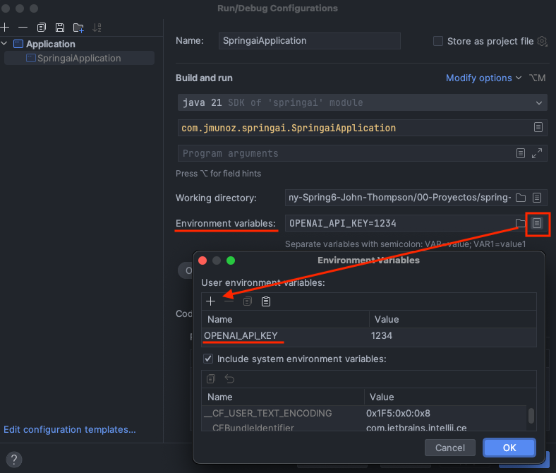
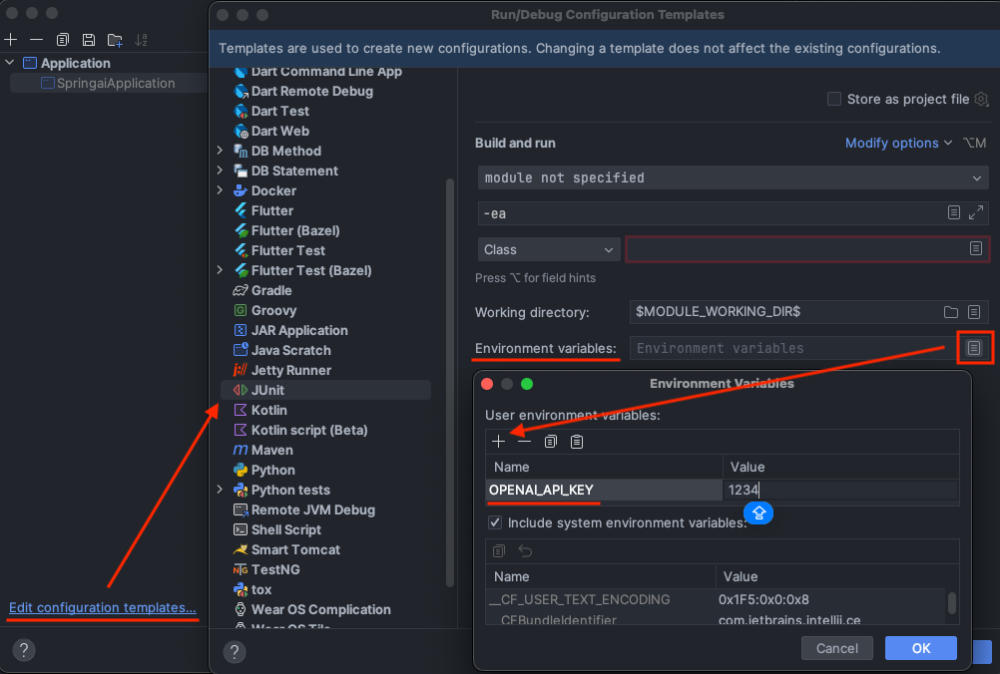

# spring-6-ai

Nuevo proyecto con un ejemplo para usar la API Key de OpenAI.

## Notas

1. Es necesario tener una API Key de OpenAI.

Esta API Key la vamos a pasar al programa usando variables de entorno usando IntelliJ.

Esa variable de entorno alimenta una propiedad de `application.properties`. En concreto hay que crear la variable de entorno `OPENAI_API_KEY`, cuyo valor pasa a la propiedad `spring.ai.openapi.api-key`: 

```
spring.ai.openapi.api-key=${OPENAI_API_KEY}
```

En IntelliJ, las variables de entorno se indican en la configuración de la ejecución de la aplicación:



2. Configurando un template (JUnit) para usar también la API Key de OpenAI.

Tenemos que configurar también la variable de entorno para ejecutar los tests. Vamos a usar IntelliJ.

Para ello, vamos a la configuración de la ejecución de la aplicación y, abajo a la izquierda veremos `Edit configuration templates...`

Lo seleccionamos y en la ventana que nos aparece, seleccionamos `JUnit` e indicamos la variable de entorno



3. Todas estas configuraciones se pueden hacer también usando configuración de Maven.

## Testing

- Clonar el repositorio
- Renombrar `application.template.properties` a `application.properties`
- Indicar en IntelliJ el valor de la variable de entorno `OPENAI_API_KEY`
  - Ver las notas 1 y 2 un poco mås arriba en esta documentación
- Ejecutar esta aplicación