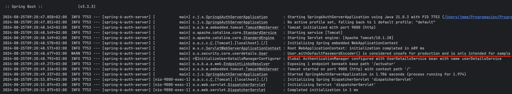

# spring-6-auth-server

Es un nuevo proyecto en el que vamos a conseguir autorización usando el framework OAuth 2 y JWT, en vez de usar la seguridad básica que ya hemos visto.

Los pasos para lograr esto son:

- Configurar un server de autenticación usando el proyecto Spring Authentication Server
- Configurar un resource server
- Como puede un RestTemplate obtener el token y usarlo para autenticarse

Vamos a ver en concreto el primer paso

## Notas

1. Para trabajar con el proyecto Spring Authentication Server hay que añadir la siguiente dependencia al POM y se puede seguir la documentación

https://docs.spring.io/spring-authorization-server/reference/getting-started.html

```
<dependency>
    <groupId>org.springframework.boot</groupId>
    <artifactId>spring-boot-starter-oauth2-authorization-server</artifactId>
</dependency>
```

2. En este proyecto se ha tenido que importar muchos paquetes.

IntelliJ lo puede hacer automáticamente con esta configuración.


3. En la ejecución puede verse claramente. Este proyecto se hace por motivos didácticos y nunca para usar en producción. 



4. Configuración de Postman para generar un token usando Client Credentials.

En el endpoint GET se ha indicado un endpoint cualquiera.

En Auth Type se ha seleccionado OAuth 2.0 y se han informado los valores.


Para obtener el token, pulsar `Get new access token` y copiarlo.

Ir a `https://www.jstoolset.com/jwt` y pegarlo. Se debe ver algo tipo así.


NOTA: No usar esta página para JWT de la empresa, puesto que no sabemos que hace con él

## Testing

- Clonar el repositorio
- Ejecutar esta aplicación
- Uso de Postman para obtener un token de nuestro authorization server