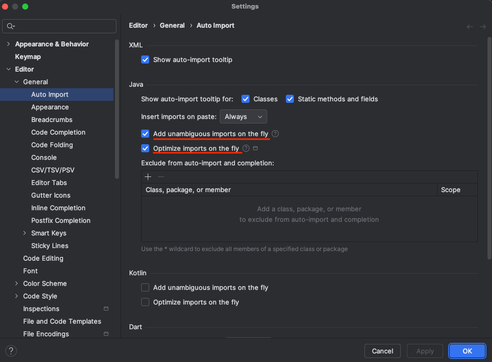

# spring-6-auth-server

Es un nuevo proyecto en el que vamos a conseguir autorización usando el framework OAuth 2 y JWT, en vez de usar la seguridad básica que ya hemos visto.

Los pasos para lograr esto son:

- Configurar un server de autenticación usando el proyecto Spring Authentication Server
- Configurar un resource server
- Como puede un RestTemplate obtener el token y usarlo para autenticarse

Vamos a ver en concreto el primer paso

## Notas

1. Para trabajar con el proyecto Spring Authentication Server hay que añadir la siguiente dependencia al POM y se puede seguir la documentación

https://docs.spring.io/spring-authorization-server/reference/getting-started.html

```
<dependency>
    <groupId>org.springframework.boot</groupId>
    <artifactId>spring-boot-starter-oauth2-authorization-server</artifactId>
</dependency>
```

2. En este proyecto se ha tenido que importar muchos paquetes.

IntelliJ lo puede hacer automáticamente con esta configuración.



## Testing

- Clonar el repositorio