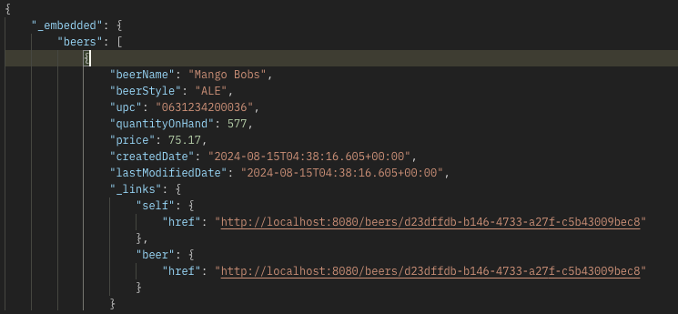
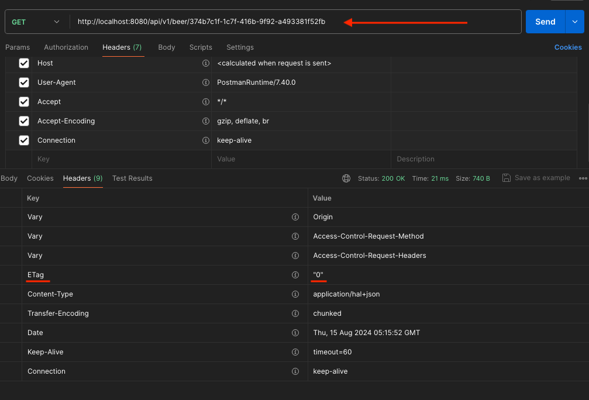

# spring-6-data-rest

Es un nuevo ejemplo (no viene de ejemplos anteriores) de, solo definiendo nuestras entidades y los repositorios, se genera una creación automática de controladores.

Spring Data REST es una herramienta que podemos usar para exponer la BD o entidades de la BD solo usando repositorios.

Es una espada de doble filo, porque vamos a tener que exponer las entidades de BD directamente al consumidor de la API.

Esto no vamos a querer hacerlo siempre, pero es muy útil para proveer una forma rápida de desarrollo de API RESTFul.

## Notas

1. Vamos a construir un ejemplo muy parecido a este: `https://sfg-beer-works.github.io/brewery-api/#tag/Beer-Service/operation/listBeers`

2. Para el ejemplo se usa la BD en memoria H2

3. Aunque en el Github del proyecto se indica otra cosa (spring-data-rest), en el POM se añade la dependencia siguiente, ya que viene curada para Spring Boot

```
<dependency>
    <groupId>org.springframework.boot</groupId>
    <artifactId>spring-boot-starter-data-rest</artifactId>
</dependency>
```

## Testing

- Clonar el repositorio
- Ejecuta el proyecto
- En la carpeta postman existen endpoints de prueba
  - Si se ejecuta `List Beers` veremos que obtenemos la lista de cervezas, pero en el proyecto no hay definido ningún controller
  - Indicar que, por defecto, hay que indicar como endpoint `beers` en plural, para que devuelva una lista con todas las cervezas
  - Por defecto, Spring Data JPA nos devuelve la lista embebida en una propiedad llamada `_embedded`

  

  Desde la property `beerName` hasta la property `lastModifiedDate` viene directamente de la entidad Beer. Vemos que la property `version` de la entidad no se expone en el body de la respuesta.

  Pero Spring Data REST también devuelve `_links`, siguiente el principio HateOas (https://www.arquitecturajava.com/que-es-el-principio-de-hateoas/) que básicamente son links a objetos, en este caso, de beer.

  - Todo el comportamiento por defecto se puede cambiar
    - Ver `application.properties` para ver qué cambios se han hecho
    - Ver también `BeerRepository`

  - Para que se muestre la propiedad `version` se usa lo que se llama ETag (https://docs.spring.io/spring-data/rest/reference/etags-and-other-conditionals.html)

  En concreto, se ejecuta el endpoint en Postman, se coge uno de los links proporcionados por HateOas y nos vamos a los headers de la respuesta.

  

  Es decir, la propiedad `version` si que aparece en la response, pero no en el body, sino en el header como un ETag.

  - Si ejecutamos el endpoint de `Create New Beer` veremos que nos devuelve un status 201 y de nuevos los links proporcionados por HateOas