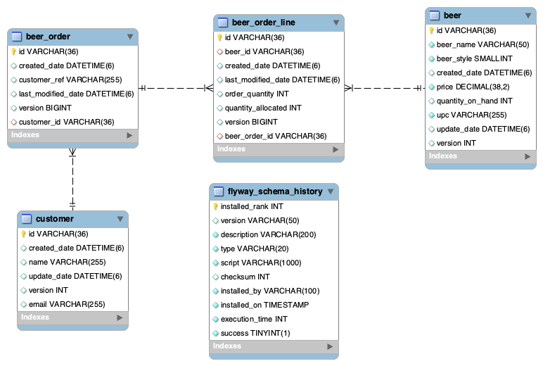

# spring-6-db-relationships

Es el mismo ejemplo `spring-6-paging-sorting` pero ahora vamos a mapear relaciones entre tablas.

Esto añade un nivel de complejidad, porque vamos a añadir tablas adicionales y usar Flyway para realizar las migraciones.

El mapeo de relaciones en JPA e Hibernate está muy maduro, es muy versátil y puede manejar desde BD standards hasta BD extrañas y muy antiguas.

## Notas

1. Creamos las tablas beer_order y beer_order_line

Se muestra el Diagrama entidad-relación (ERD) de las tablas y sus relaciones entre ellas.

2. Vemos que, para crear un helper mehod para evitar hacer el flush (problemas de rendimiento) tenemos que:

  - BeerOrderRepositoryTest.java - Usar save() en vez de saveAndFlush()
  - BeerOrderEntity.java - Sobreescribir setCustomer, donde añadimos al Set el customer.
    - También eliminamos @AllArgsConstructor, porque si no, el builder del test no accede al setter
    - Creamos nuestros constructor y usamos nuestro setter
  - CustomerEntity.java - Inicializar el Set y Usar @Builder.Default para que Lombok (parte del builder) lo inicialice como hash set vacío 

## Testing

- Clonar el repositorio
- Renombrar `application-localmysql.template.properties` a `application-localmysql.properties` e indicar sus valores
- Ejecutar el proyecto con el siguiente profile activo `-Dspring.profiles.active=localmysql`
  - Importante si queremos usar MySql en vez de H2
- Aunque no haga falta, porque usamos Flyway, existe la carpeta `scripts` y dentro un fichero con los SQLs necesarios para crear las nuevas tablas necesarias para trabajar con la aplicación
  - Flyway: en la carpeta `resources/db.migration` vemos la migración `V3__add-order-tables.sql` que hace lo mismo que el fichero de la carpeta `scripts`
  - Flyway: en la carpeta `resources/db.migration` vemos la migración `V4__category.sql` donde se crean tablas para el ejemplo con relación Many to Many
- Ejecutar todos los tests
  - En concreto, nos concentramos en `BeerOrderRepositoryTest.java` donde vemos el concepto de flush y el de helper method.