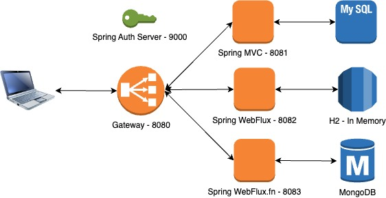

# spring-6-docker

Esta es la carpeta contenedora de los proyectos que se van a dockerizar, que son:

- spring-6-auth-server
  - Puerto 9000
- spring-6-gateway
  - Puerto 8080
- spring-6-rest-mvc-orders
  - Puerto 8081 y usando MySql
- spring-6-webflux-resource-server
  - Puerto 8082 y usando H2
- spring-6-webflux-fn-resource-server
  - Puerto 8083 y usando MongoDB

La imagen a tener en la cabeza es esta>

## Notas

1. En la carpeta `docker` pueden encontrarse distintas ayudas de comandos

## Testing

- Clonar este repositorio
- Llevar la carpeta spring-6-docker a IntelliJ para que tenga todos los proyectos
- Para lanzar todo:
  - Crear imágenes: Acceder a cada uno de los proyectos y ejecutar:
    - `./mvnw clean package spring-boot:build-image`
  - Ejecutar contenedores: 
    - `docker run --name auth-server --platform linux/amd64 -d -p 9000:9000 spring-6-auth-server:0.0.1-SNAPSHOT`
    - `docker run --name rest-mvc -d -p 8081:8080 --platform linux/amd64 -e SPRING_PROFILES_ACTIVE=localmysql \
 -e SPRING_SECURITY_OAUTH2_RESOURCESERVER_JWT_ISSUER_URI=http://auth-server:9000 -e SPRING_DATASOURCE_URL=jdbc:mysql://mysql:3306/restdb  \
 -e SERVER_PORT=8080 --link auth-server:auth-server --link mysql:mysql restmvc:0.0.1-SNAPSHOT`
      - Tener en cuenta mi configuración de MySql (esta es fake, ver archivo `docker/RunDockerContainerRestMVCMySql.md)
    - `docker run --name gateway -d -p 8080:8080 --platform linux/amd64 -e SPRING_PROFILES_ACTIVE=docker --link auth-server:auth-server --link rest-mvc:rest-mvc spring6gateway:0.0.1-SNAPSHOT`