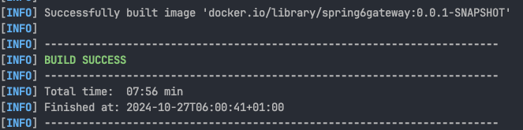

# spring-6-gateway

Dockerización.

## Notas

1. Dockerizar este proyecto

Recordar que en el archivo `resources/application.yml` tenemos la configuración de los routes, con los distintos puertos de cada proyecto.

Para construir una imagen, ir a la terminal, a la carpeta donde está este proyecto de gatewway y ejecutar:

`./mvnw clean package spring-boot:build-image`

Ver que se crea la imagen, tanto en la terminal

Como en Docker Desktop

2. Inspeccionar la imagen creada

Sirve para ver su nombre, como se construyó la imagen, la arquitectura sobre la que corre, las diferentes layers que la componen, y metadata.

Hay que indicar un comando y el nombre de la imagen que se indicó en la terminal al crear dicha imagen.

Usar el comando `docker image inspect docker.io/library/spring6gateway:0.0.1-SNAPSHOT`

3. Ejecutar la imagen

Ejecutar el siguiente comando en la terminal: `docker run -d -p 8080:8080 docker.io/library/spring6gateway:0.0.1-SNAPSHOT`

Ejecutar `docker container list` para ver el contenedor creado.

Vemos entre toda la info disponible el campo `CONTAINER ID` que en mi caso tiene el valor `c70e96de30e6`.

Este valor es importante para luego parar el contenedor, entre otras cosas.

Ahora podemos ir a `Postman` para confirmar que accedemos a esa imagen:

- Importar en Postman la carpeta `/postman/actuator` y ejecutar `Actuator Health`

Para parar la ejecución del contenedor ejecutar en la terminal el comando `docker stop c70e96de30e6`

Y para volver a ejecutar el contenedor, ejecutar en la terminal el comando `docker start c70e96de30e6`

Para ver los logs del contenedor, ejecutar en la terminal el comando `docker logs -f c70e96de30e6`

Y para cancelar la visualización de logs pulsar en la terminal `Ctrl+C`.

3. Darle al contenedor un nombre distinto y ejecución compatible con Apple Silicon

Parar la ejecución del contenedor, si este se está ejecutando: `docker stop c70e96de30e6`

Ejecutar el siguiente comando en la terminal: 

`docker run -d -p 8080:8080 --name spring-gateway --platform linux/amd64 docker.io/library/spring6gateway:0.0.1-SNAPSHOT`

Con esto ya podemos trabajar mejor por nombre en vez de usar el `CONTAINER ID`

Ahora, para parar el contenedor, podemos ejecutar en la terminal: `docker stop spring-gateway`

Y si tenemos que volver a arrancarlo, podemos ejecutar `docker start spring-gateway`

4. No ejecutar los tests a la hora de crear la imagen

Para crear una imagen Docker, pero sin ejecutar los tests, ejecutar en la terminal el comando: `./mvnw clean package spring-boot:build-image -DskipTests=true`