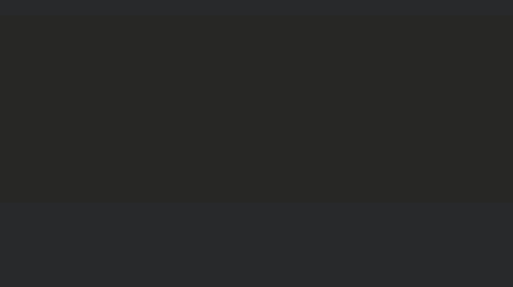

# spring-6-flyway

Es el mismo ejemplo `spring-6-validations` pero usando conexión a BBDD MySQL y el migrador Flyway.

Se usa Flyway para poblar la BD y migrar diferentes estructuras de BD a la BD.

Tener una herramienta de migración es muy importante, porque si vamos a tener muchos entornos, nos da una forma de migrar ese código.

Podemos tener un entorno de desarrollo, un entorno de CI, un entorno de tests, un entorno UAT y un entorno de producción, y tener esta herramienta de migración nos va a ayudar mucho a migrar los cambios de BD junto con los cambios de código, porque lo normal es que esto se tenga que hacer en tandem.

## Notas

1. Comandos Flyway

2. Pasos que vamos a realizar

- Configurar Spring Boot para usar Flyway
- Configurar una migración inicial
- Cambiar tablas existentes con Flyway

3. Para configurar una migración inicial, Spring Boot por defecto busca un directorio en la carpeta `resources`.

Se crea en la carpeta `resources` una carpeta `db` y dentro creamos la carpeta `migration`.

Este comportamiento por defecto se puede sobreescribir con una property.

En el proyecto `spring-6-mysql` creamos el script `drop-and-create.sql`. Lo he movido a esta carpeta `migration` y lo renombramos.

La forma en la que funciona Flyway es buscando un nombre de archivo que empiece por `V` mayúscula y un número de versión seguido de dos guiones bajos y un texto libre.

En mi caso, renombro el archivo a `V1__init-mysql-database.sql`.

Usando SQuirreL elimino las dos tablas, `beer` y `customer` que se habían generado automáticamente en el proyecto `spring-6-mysql`, porque ya no quiero que lo haga Hibernate (he cambiado la property spring.jpa.hibernate.ddl-auto a validate)

Con esto ya podemos ejecutar el proyecto.

En SQuirreL tengo que entrar con el usuario root, sino no veré las tablas porque otros usuarios no tendrán permisos.

## Testing

- Clonar el repositorio
- Renombrar `application-localmysql.template.properties` a `application-localmysql.properties` e indicar sus valores
- Ejecutar el proyecto con el siguiente profile activo `-Dspring.profiles.active=localmysql`
  - Deben generarse las tablas `beer`, `customer` y un historial de flyway `flyway_schema_history` donde podemos ver en que estado está la BD, que scripts se han aplicado y cuales no.

## IMPORTANTE

En ficheros `.properties` hay que indicar que el encoding sea UTF-8 ya que por defecto es ISO-8859-1 y esto falla al hacer el Maven Compile.

Ir a Settings y hacer esto:

