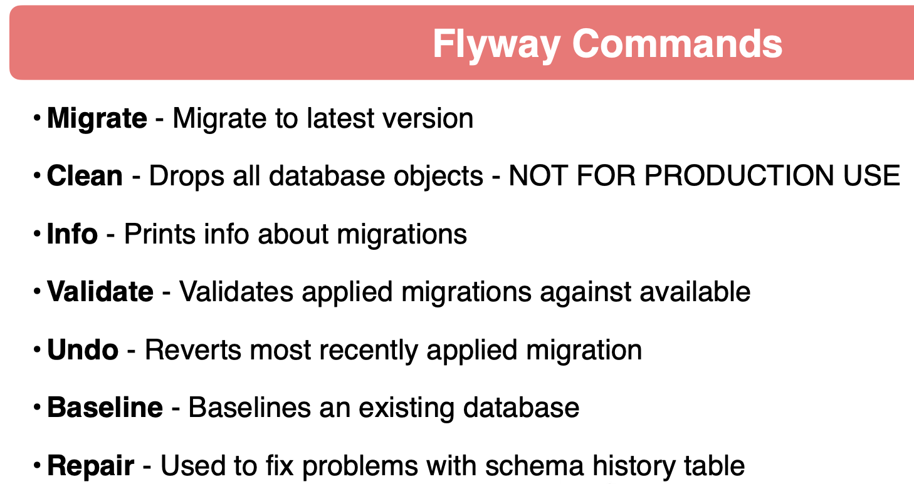

# spring-6-flyway

Es el mismo ejemplo `spring-6-validations` pero usando conexión a BBDD MySQL y el migrador Flyway.

Se usa Flyway para poblar la BD y migrar diferentes estructuras de BD a la BD.

Tener una herramienta de migración es muy importante, porque si vamos a tener muchos entornos, nos da una forma de migrar ese código.

Podemos tener un entorno de desarrollo, un entorno de CI, un entorno de tests, un entorno UAT y un entorno de producción, y tener esta herramienta de migración nos va a ayudar mucho a migrar los cambios de BD junto con los cambios de código, porque lo normal es que esto se tenga que hacer en tandem.

## Notas

1. Comandos Flyway

2. Pasos que vamos a realizar

- Configurar Spring Boot para usar Flyway
- Configurar una migración inicial
- Cambiar tablas existentes con Flyway

## Testing

- Clonar el repositorio
- Renombrar `application-localmysql.template.properties` a `application-localmysql.properties` e indicar sus valores
- Ejecutar los tests
