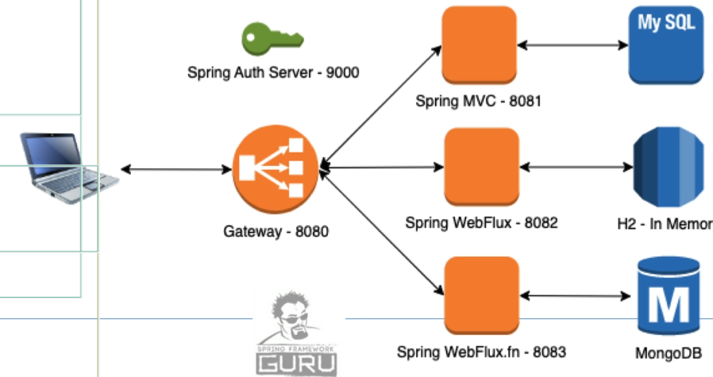

# spring-6-gateway

Nuevo proyecto para crear un Gateway que, usando `spring-6-auth-server` va a llamar (hacer los requests) a los distintos proyectos `spring-6-resource-server`, que es el MVC, `spring-6-webflux-resource-server` y `spring-6-webflux-fn-resource-server`.

Nuestro Gateway también va a ser un OAuth2 Resource Server, para que solo nos lleguen peticiones a las rutas que queremos.

Para no crear otro proyecto, porque es muy sencillo, añadimos Spring Boot Actuator, Logbook y Logstash aquí mismo.

## Notas

1. Lo que queremos conseguir es esto



2. Requerimientos

- Proyecto `spring-6-auth-server`
  - Puerto: 9000
- Proyecto `spring-6-resource-server`: Es el proyecto Spring MVC
  - Puerto: 8081
  - MySql debe estar ejecutándose
- Proyecto `spring-6-webflux-resource-server`
  - Puerto: 8082
- Proyecto `spring-6-webflux-fn-resource-server`
  - Puerto: 8083
  - MongoDB debe estar ejecutándose

3. Para este proyecto, se ha eliminado `application.properties` y creado `application.yml`

Esto es porque YAML proporciona más flexibilidad a la hora de crear propiedades, y en este proyecto, el de Gateway, se utilizan muchas propiedades.

4. En el POM hay que añadir la dependencia siguiente

```
<dependency>
    <groupId>org.springframework.cloud</groupId>
    <artifactId>spring-cloud-starter-gateway</artifactId>
</dependency>
```

5. Debugging

Saber que ha fallado no es fácil, por eso añadimos estas propiedades en `application.yaml`.

Con ellas vemos el tráfico entre los distintos proyectos y logs.

El nivel de indentación es importantísimo

```
spring:
  cloud:
    gateway:
      routes:
        - id: spring-6-rest-mvc
          uri: http://localhost:8081
          predicates:
            - Path=/api/v1/**
      # Desde aquí hasta el final es la parte de debug.
      # No la queremos en Producción, solo para resolver problemas en tiempo de desarrollo.      
      httpserver:
        wiretap: true
      httpclient:
        wiretap: true
logging:
  level:
    root: error
    reactor.netty: trace
    org.springframework.cloud.gateway: trace
    org.springframework.http.server.reactive: trace
```

Al indicar `reactor.netty: trace` aparece una excepción `ChannelOperation terminal stack` que no es realmente un error.

6. https://docs.spring.io/spring-framework/docs/current/javadoc-api/org/springframework/web/util/pattern/PathPattern.html

/resources/*.png — matches all .png files in the resources directory

/resources/** — matches all files underneath the /resources/ path, including /resources/image.png and /resources/css/spring.css

7. Para convertir nuestro Gateway en un OAuth2 Resource Server hay que añadir al POM la siguiente configuración

```
<dependency>
    <groupId>org.springframework.boot</groupId>
    <artifactId>spring-boot-starter-oauth2-resource-server</artifactId>
</dependency>
```

En nuestro archivo `application.yml` tenemos que añadir ciertas properties de configuración.

Y hay que crear un fuente java de configuración.

8. Añadir la dependencia para Spring Boot Actuator

```
<dependency>
    <groupId>org.springframework.boot</groupId>
    <artifactId>spring-boot-starter-actuator</artifactId>
</dependency>
```

Se ha añadido la configuración de seguridad en `SpringSecConfig.java`.

9. Añadir Integración de Actuator para las sondas en Kubernates

Se hace vía properties.

```
management.endpoint.health.probes.enabled=true
management.health.readinessstate.enabled=true
management.health.livenessstate.enabled=true
```

10. Logbook

Para trabajar con Logbook solo hay que añadir la dependencia

```
<properties>
    <logbook.version>3.9.0</logbook.version>
</properties>

<dependency>
    <groupId>org.zalando</groupId>
    <artifactId>logbook-spring-boot-starter</artifactId>
    <version>${logbook.version}</version>
</dependency>

<dependency>
    <groupId>org.zalando</groupId>
    <artifactId>logbook-spring-boot-webflux-autoconfigure</artifactId>
    <version>${logbook.version}</version>
</dependency>
```

Y la siguiente property en application.properties: `logging.level.org.zalando.logbook=trace`.

Hay que ejecutar también el proyecto `spring-6-auth-server` porque nos hace falta el token OAuth2.0.

11. Logstash

Sirve para habilitar JSON logging. Hay que añadir las siguientes dependencias

```
<properties>
    <logstash-logback-encoder.version>8.0</logstash-logback-encoder.version>
</properties>

<dependency>
    <groupId>net.logstash.logback</groupId>
    <artifactId>logstash-logback-encoder</artifactId>
    <version>${logstash-logback-encoder.version}</version>
</dependency>
```

Y para configurarlo, se crea dentro de la carpeta `resources` el fichero `logback-spring.xml` y se escribe dicha configuración.

12. Que Logbook y Logstash trabajen juntos

Hay que añadir la siguiente dependencia

```
<dependency>
    <groupId>org.zalando</groupId>
    <artifactId>logbook-logstash</artifactId>
    <version>${logbook.version}</version>
</dependency>
```

Y se crea la siguiente configuración en el package `config`, con nombre `LogbookConfig.java`.

La idea es poder obtener en consola el JSON Payload en formato JSON, no String, y con el formato sin escapar.

Con esto, podemos buscar problemas de ejecución y realizar auditorías.


## Testing

- Clonar el repositorio
- Ejecutar los siguientes 5 proyectos, teniendo en cuenta sus requerimientos (ver nota 2)
  - spring-6-auth-server
  - spring-6-resource-server
  - spring-6-webflux-resource-server
  - spring-6-webflux-fn-resource-server
  - spring-6-gateway
- Obtener el token usando el endpoint que está en esta carpeta `postman`, y, una vez obtenido el token, pulsar `Use Token` y probar el endpoint
  - En el endpoint alternar entre `v1`, `v2` y `v3` para probar los endpoints de los tres proyectos
  - El port de este endpoint si que debe ser el `8080`, para salir por el gateway
- Para probar `Spring Boot Actuator`, ejecutar este proyecto e ir a Postman
  - En la carpeta `/postman/actuator` tenemos los distintos endpoints
- Para probar `Logbook` solo hay que ejecutar el proyecto
  - Ejecutar también el proyecto `spring-6-auth-server`
    - Obtener un token usando el endpoint que está en su carpeta `postman`, y, una vez obtenido el token, pulsar `Use Token`
  - En la carpeta `postman` tenemos los distintos endpoints. Copiar el token en cada uno y probar
  - Debe verse la traza con la request en la consola de ejecución del proyecto MVC, en formato String
  - Debe verse la traza con la response en la consola de ejecución del proyecto MVC, en formato String
- Para probar `Logbook` junto con `Logstash` solo hay que ejecutar el proyecto
  - Ejecutar también el proyecto `spring-6-auth-server`
    - Obtener un token usando el endpoint que está en su carpeta `postman`, y, una vez obtenido el token, pulsar `Use Token`
  - En la carpeta `postman` tenemos los distintos endpoints. Copiar el token en cada uno y probar
  - Debe verse la traza con la request en la consola de ejecución del proyecto MVC, ahora en formato JSON
  - Debe verse la traza con la response en la consola de ejecución del proyecto MVC, ahora en formato JSON