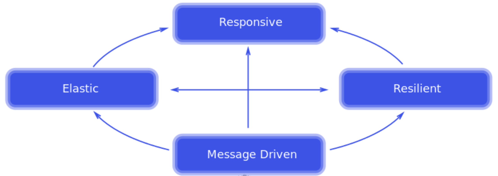

# spring-6-intro-reactive

Proyecto nuevo para mostrar las capacidades de la programación reactiva, que se basa en un modelo no bloqueante de programación, e introduciéndonos en la forma es la que se usa en SpringBoot.

## Notas

1. Reactive Manifesto

2. Características de la programación reactiva

- Data Streams
- Asynchronous
- Non-blocking
- Backpressure
- Failures as Messages

3. Tipos reactivos de Spring WebFlux comparado con Spring MVC

4. IMPORTANTE: Al tratar con Monos, todas las variables que se usen dentro del stream deben ser final.

Es decir, no se permite la mutación de variables en el stream.

## Testing

- Clonar el repositorio
- Ejecutar el test `PersonRepositoryImplTest`