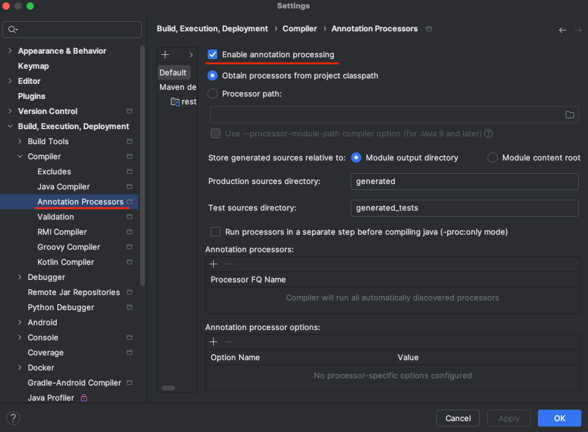

# spring-6-lombok

Vamos a hacer un ejemplo con Project Lombok.

## Notas

Para que funcione Lombok en IntelliJ IDEA:

Con `Delombok` se puede saber qué código va a insertar Lombok en la clase Java. Lo podemos dejar si necesitamos ese código, porque queramos modificar algo.

Se selecciona de la siguiente manera sobre una clase anotada con anotaciones Lombok.

Para que funcione `log.debug` hace falta indicar en el fichero `application.properties` la siguiente property: `logging.level.com.jmunoz=debug`

## Testing

- Clonar el repositorio
- Ir a Maven y seleccionar del Lifecycle la opción Compile
  - Deberíamos ver en la carpeta `target/classes/com/jmunoz/restmvc/model/Beer.class` los getter, setter, el constructor sin argumentos, equals() y hashMap(), el método toString() y el Builder
  - Deberíamos ver en la carpeta `target/classes/com/jmunoz/restmvc/controller/BeerController.class` el constructor generado
- Leer los comentarios de las clases
- Ejecutar el test
  - Deben verse los logs con nivel DEBUG y la instancia de Beer 