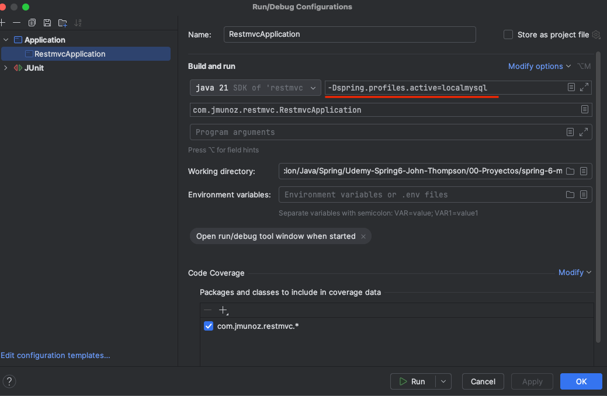

# spring-6-mysql

Es el mismo ejemplo `spring-6-validations` pero usando conexión a BBDD MySQL.

Vamos a usar un profile para MySQL para habilitar MySQL para la app, y se va a seguir usando la BBDD en memoria H2 para nuestros tests.

## Notas

Se ha creado el profile para MySQL en la carpeta resources, fuente `application-localmysql-properties`.

Lo que hace Spring Boot es, si creamos un fichero properties que incluya `-` seguido de texto, como por ejemplo `-localmysql`, ese fichero se vuelve un profile que se activará para ese profile.

Este profile se indica en IntelliJ accediendo a `Edit...`  e informando en las `VM Options` lo siguiente: `-Dspring.profiles.active=localmysql` donde `localmysql` es el profile que quiero activar.

Se corrigen dos problemas cuando se transiciona del uso de H2 a MySQL, y que no dan error en H2:

- Para el campo ID, hay que indicar la longitud del Varchar explícitamente: `varchar(36)`
- Hibernate intenta grabar en el campo ID el valor como binary. Hay que mapear a char usando `@JdbcTypeCode(SqlTypes.CHAR)`

## Testing

- Clonar el repositorio
- Renombrar `application-localmysql.template.properties` a `application-localmysql.properties` e indicar sus valores
- Ejecutar los tests