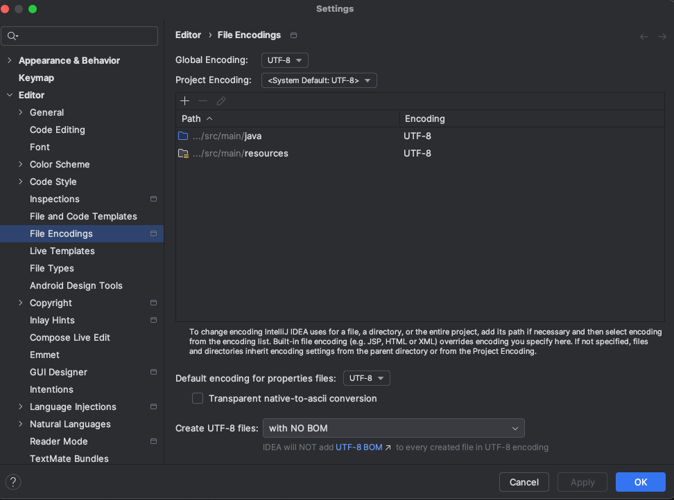

# spring-6-mysql

Es el mismo ejemplo `spring-6-validations` pero usando conexión a BBDD MySQL.

Vamos a usar un profile para MySQL para habilitar MySQL para la app, y se va a seguir usando la BBDD en memoria H2 para nuestros tests.

## Notas

1. Se ha creado el profile para MySQL en la carpeta resources, fuente `application-localmysql-properties`.

Lo que hace Spring Boot es, si creamos un fichero properties que incluya `-` seguido de texto, como por ejemplo `-localmysql`, ese fichero se vuelve un profile que se activará para ese profile.

Este profile se indica en IntelliJ accediendo a `Edit...`  e informando en las `VM Options` lo siguiente: `-Dspring.profiles.active=localmysql` donde `localmysql` es el profile que quiero activar.


2. Se corrigen dos problemas cuando se transiciona del uso de H2 a MySQL, y que no dan error en H2:

- Para el campo ID, hay que indicar la longitud del Varchar explícitamente: `varchar(36)`
- Hibernate intenta grabar en el campo ID el valor como binary. Hay que mapear a char usando `@JdbcTypeCode(SqlTypes.CHAR)`

En términos de operaciones, crear una conexión a la BD es una operación muy pesada. Si no se tiene cuidado podemos acabar con más de 200 conexiones.

3. Hikari crea un pool de conexiones a la BD y establece la conexión de red a la BD, con la idea de tener varias conexiones establecidas (muchas menos de las 200, por ejemplo 5), lo que ayuda significativamente cuando el sistema ya tiene mucha carga.

Esta configuración de Hikari se configura en el profile `application-localmysql-properties`.

4. Hibernate puede crear un script de creación de BD (nombre en este caso drop-and-create.sql, que es el indicado en la última property de las aquí indicadas) usando reflexión a partir de nuestras entidades JPA.

El problema es que, cada vez que se ejecuta el programa, añade de nuevo los scripts en vez de sustituirlos, pero es muy útil para prototipado, o para comenzar con H2 y rápidamente pasar a otro Sistema Gestor de BD.

```
spring.jpa.properties.jakarta.persistence.schema-generation.scripts.action=drop-and-create
spring.jpa.properties.jakarta.persistence.schema-generation.scripts.create-source=metadata
spring.jpa.properties.jakarta.persistence.schema-generation.scripts.drop-target=drop-and-create.sql
spring.jpa.properties.jakarta.persistence.schema-generation.scripts.create-target=drop-and-create.sql
```

5. Inicializar una BD usando JPA

`https://docs.spring.io/spring-boot/docs/2.1.x/reference/html/howto-database-initialization.html`

Recordar que, para producción, el valor de la property `spring.jpa.hibernate.ddl-auto` que puede usarse es `validate`.

Para producción, además, lo mejor es crear un fichero `import.sql` en la carpeta `resources` que contendrá los SQL de creación de BD. Spring Boot lo ejecutará automáticamente.

También se pueden crear ficheros `schema.sql` y `data.sql`, que, de nuevo, Spring Boot busca de forma automática. Sirven para crear el esquema de BD y para informar data en BD.

Para una plataforma específica, se puede usar `schema-${platform}.sql` y `data-${platform}.sql`, donde platform es el valor de la property `spring.datasource.platform`. Valores posibles pueden ser `h2`, `oracle`, `mysql`, `postgresql`...

Todo esto queda como información, porque en este curso se va a usar una herramienta de migración llamada `Flyway` porque nos va a ayudar a manejar la evolución de la BD.

## Testing

- Clonar el repositorio
- Renombrar `application-localmysql.template.properties` a `application-localmysql.properties` e indicar sus valores
- Ejecutar los tests
- 
## IMPORTANTE

En ficheros `.properties` hay que indicar que el encoding sea UTF-8 ya que por defecto es ISO-8859-1 y esto falla al hacer el Maven Compile.

Ir a Settings y hacer esto:

