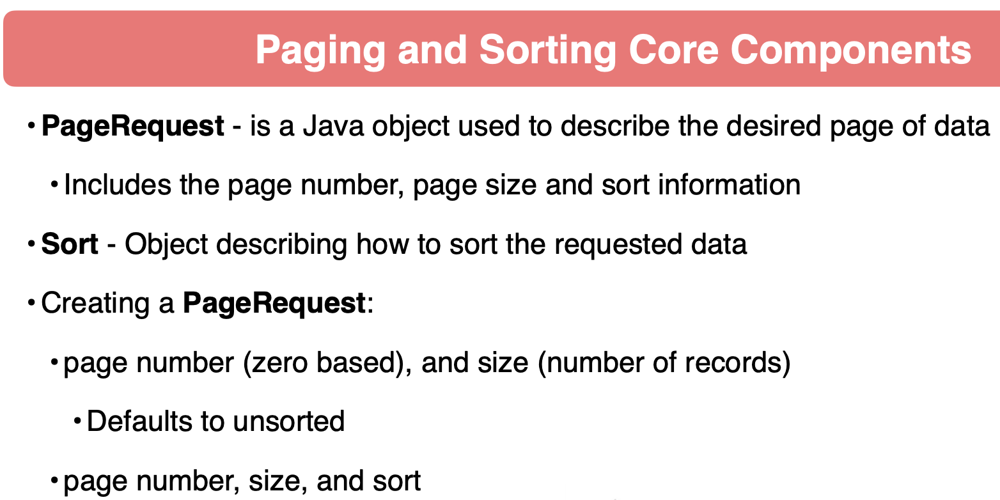
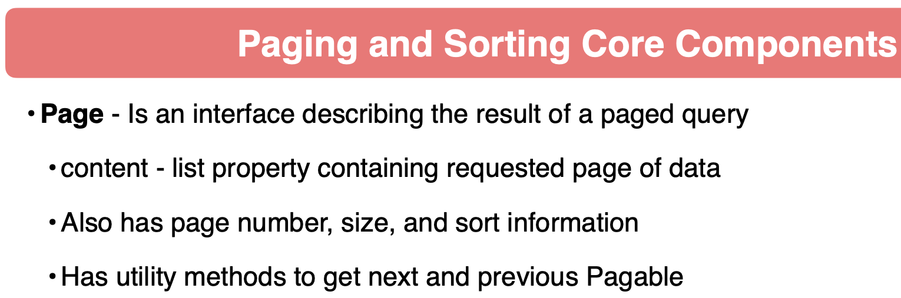

# spring-6-paging-sorting

Es el mismo ejemplo `spring-6-query-parameters` pero ahora vamos a permitir realizar paginación y ordenamiento.

Si tratamos con record sets muy grandes, queremos poder paginar y ordenar esa data, con la idea de permitir a los usuarios de nuestra API procesar esa data en trozos manejables.

## Notas

1. Los componentes principales de Paginación y Ordenamiento son

Para implementarlos fácilmente en query methods Spring Data JPA:

- Añadir al método, como parámetro, un `PageRequest`
- Usar `Page` con genérico para el tipo de retorno

2. Vamos a modificar el controller para que acepte parámetros de paginación. En concreto, nos va a llegar `pageNumber` y `pageSize`.

Recordar que las operaciones de página comienzan en 0 (0 index)

## Testing

- Clonar el repositorio
- Renombrar `application-localmysql.template.properties` a `application-localmysql.properties` e indicar sus valores
- Ejecutar el proyecto con el siguiente profile activo `-Dspring.profiles.active=localmysql`
- Ejecutar todos los tests
  - En concreto, `BeerControllerIT`, test `testListBeersByStyleAndNameShowInventoryTruePage2()`
  - Pero al cambiar el return al tipo Page se rompieron todos los tests, así que es bueno ejecutarlos todos