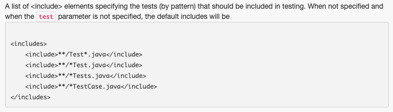
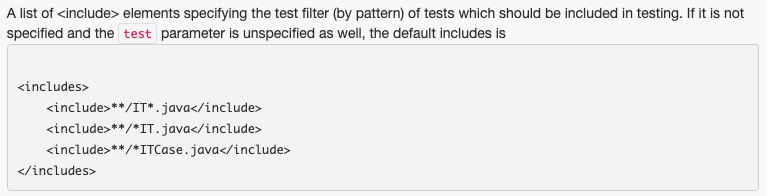

# spring-6-rest-mvc-test-containers

Parte del ejemplo `spring-6-flyway`

- Nueva sección que aparece entre las secciones `Flyway Migrations with Spring Boot` y `CSV File Uploads`
- Los `Test containers` fueron añadidos a la versión 3.1 de Spring Boot
- Nos permite traer un contenedor Docker y automáticamente configurarlo para conectarlo a nuestra configuracieon de BBDD
- Van a arrancar en puertos aleatorios para evitar conflictos de puertos en el sistema host y, aunque el puerto cambia con cada ejecución, la configuración automática de Spring Boot recogerá los ajustes del contenedor Docker
- Nos permite añadir pruebas de integración con BBDD, message brokers, auth servers... que son portables y funcionarán en múltiples plataformas
- Necesitamos tener Docker instalado

Documentación: `https://docs.spring.io/spring-boot/reference/testing/testcontainers.html`

## Notas

1. Añadir las dependencias

Tenemos que añadir 3 dependencias:

```
<dependency>
    <groupId>org.springframework.boot</groupId>
    <artifactId>spring-boot-testcontainers</artifactId>
    <scope>test</scope>
</dependency>

<dependency>
    <groupId>org.testcontainers</groupId>
    <artifactId>junit-jupiter</artifactId>
</dependency>

<dependency>
    <groupId>org.testcontainers</groupId>
    <artifactId>mysql</artifactId>
</dependency>
```
2. Test Containers Dynamic Properties

Ver la clase de test `repositories/MySqlTest.java`.

Notar que se usan la anotaciones `@TestContainers` a nivel de clase y `@Container` y `@DynamicPropertySource` a nivel de método.

Lo que hacemos es sobreescribir propiedades de conexión de MySQL, en concreto username, password y url, para que use las del test container.

3. Using Service Connection with Test Containers

Ver la clase de test `repositories/MySqlTestServiceConnection.java`

En el punto 2 vimos una manera "difícil" de configurar los test containers.

Usando `@ServiceConnection` se simplifica mucho más toda esta configuración.

Lo que hace es marcar ese contenedor para, automáticamente, sobreescribir las propiedades de conexión.

4. Using Maven Failsafe for Running Integration

Ver la clase de test `repositories/MySqlIT.java`

El uso de test containers tiene un inconveniente, que es que cae el rendimiento de las pruebas.

Añadiendo a nivel de clase la anotación `@Disabled` para que no se ejecuten los tests containers, y ejecutando el Lifecycle de Maven `test`, dichos tests tardaron 6 sg en ejecutarse.

Eliminando la anotación `@Disabled` para que se ejecuten los tres tests containers, y ejecutando el Lifecycle de Maven `test`, dichos tests tardaron en ejecutarse casi 26 sg.

Vemos como podemos descargar cierta sobrecarga de los tests usando Maven.

Hay dos plugin que se utilizan:

- Se usa el plugin `Maven Surefire`, `https://maven.apache.org/surefire/maven-surefire-plugin/`, que está diseñado para ejecutar tests unitarios.

Se incluyen (includes) los elementos específicos de tests `https://maven.apache.org/surefire/maven-surefire-plugin/test-mojo.html`



Todos los tests unitarios se ejecutan con el ciclo Maven `test`.

- Se usan el plugin `Maven Failsafe`, `https://maven.apache.org/surefire/maven-failsafe-plugin/`, que está diseñado para ejecutar tests de integración.

Los tests de integración tardan más en ejecutarse, necesitan trabajar con más dependencias, como arrancar SpringBoot, y debe haber pocos.

Se habla en la comunidad de un 80% de tests unitarios y un 20% de tests de integración.

Se incluyen (includes) los elementos específicos de tests de integración: ``



Se suelen ejecutar usando el ciclo de Maven `verify`.

Vamos a aprender como configurar `Apache Maven Failsafe` y lo vamos a usar para nuestros tests de integración, con la idea de tener tests unitarios más rápidos y, para los tests de integración, más pesados, llevarlos a la fase `verify`.

En este ejemplo, vamos a usar MySQL para los tests de integración, mientras que para nuestros tests unitarios, vamos a usar la BBDD en memoria H2.

En el pom, incluir el siguiente plugin:

```
<plugin>
    <groupId>org.apache.maven.plugins</groupId>
    <artifactId>maven-failsafe-plugin</artifactId>
    <version>3.5.2</version>
    <executions>
        <execution>
            <goals>
                <goal>integration-test</goal>
                <goal>verify</goal>
            </goals>
        </execution>
    </executions>
</plugin>
```

5. Using Spring Boot Docker Compose

A partir de SpringBoot 3.1, Spring añadió soporte a Docker Compose. Es muy útil cuando queremos hacer tests o ejecutar nuestra aplicación contra un entorno Docker local.

Vamos a configurar nuestro proyecto para usarlo, para ello, en el pom hay que añadir:

```
<dependency>
    <groupId>org.springframework.boot</groupId>
    <artifactId>spring-boot-docker-compose</artifactId>
    <scope>runtime</scope>
    <optional>true</optional>
</dependency>
```

Luego necesitamos incluir en el proyecto, en el root, un fichero `compose.yaml`.

El siguiente paso es ir a `application.properties` y añadir: `spring.docker.compose.enabled=false`. Aquí deshabilitamos docker compose, ya que trabajamos con H2.

Y, por último, en `application-localmysql.properties` añadir: `spring.docker.compose.enabled=true`. Con esto habilitamos docker compose cuando activamos el profile MySQL.

## Testing

- Clonar el repositorio
- Renombrar `application-localmysql.template.properties` a `application-localmysql.properties` e indicar sus valores
- Ejecutar con debug el test `MySqlTest.java`
  - Para ejecutar, eliminar @Disabled
  - Hay que tener arrancado Docker (o Docker Desktop)
  - Al ejecutar el debug del test, si vamos a Docker, veremos una imagen `mysql`, y si vamos al container, veremos un puerto asignado random
  - Ver, del debug, `this.dataSource` cuyos valores `username`, `password` y `jdbcUrl` deben haber sido sustituidos por los del test container
- Ejecutar el test `MySqlTestServiceConnection.java` y ver que funciona
  - Para ejecutar, eliminar @Disabled

- Con la clase `Using Maven Failsafe for Running Integration Tests`, hay que ejecutar el ciclo Maven `test` para ejecutar los tests unitarios, y `verify` para ejecutar los tests de integración
  - Por eso se ha puesto `@Disabled` en los tests anteriores, porque realmente son tests de integración, y no queremos que se ejecuten como unitarios porque tardan mucho
  - Solo queda activo el test de integración `MySqlIT.java`

- Para la parte de Spring Boot Docker Compose, solo hay que ejecutar la aplicación con el siguiente profile activo `-Dspring.profiles.active=localmysql`
  - De los logs de arranque, debemos fijarnos que aparezca `The following 1 profile is active: "localmysql"`
  - Para la parte de Docker Compose debemos ver en los logs `Using Docker Compose file ...\compose.yaml`
  - También aparecerá esto `Database: jdbc:mysql://127.0.0.1:53034/mydatabase (MySQL 9.1)`
    - Esto es lo mismo que vimos en los tests con `@ServiceConnection`, es decir, Spring automáticamente enlaza las propiedades de BBDD por nosotros
  - Y si vamos a Docker Desktop veremos arrancada una imagen de mysql