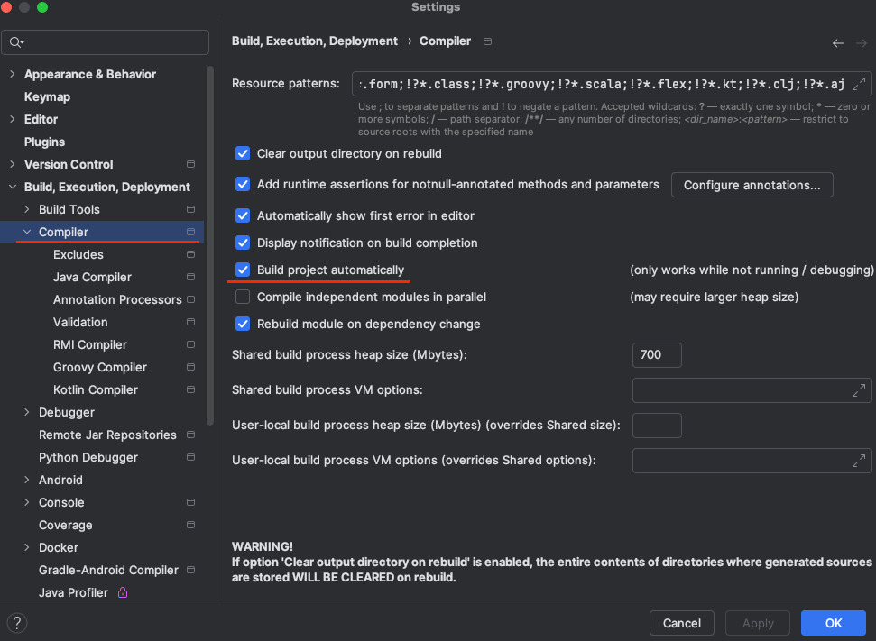

# spring-6-rest-mvc

Vamos a hacer un ejemplo de app REST MVC codificando un CRUD completo.

Vamos a hacer un ejemplo de testing usando Spring MockMVC con Mockito.

Vamos a hacer ejemplos de manejo de excepciones con Spring MVC y usarlo en los tests.

## Notas

**Live Reload**
Para añadir Live Reload al proyecto hay que añadir al POM la dependencia `DevTools`:

```
<dependency>
    <groupId>org.springframework.boot</groupId>
    <artifactId>spring-boot-devtools</artifactId>
</dependency>
```

Y para que funcione en IntelliJ hay que habilitar lo siguiente en Settings:



**Header: Property Location**

Las buenas prácticas al trabajar con RESTful API indican devolver al cliente información sobre el objeto que se creó y la propiedad del header llamada `location` 

```
@PostMapping
public ResponseEntity<Beer> handlePost(@RequestBody Beer beer) {
    Beer savedBeer = beerService.saveNewBeer(beer);

    // Una buena práctica al trabajar con RESTful APIs es devolver al cliente
    // información sobre el objeto que se creó y la propiedad del header llamada location.

    // Esto va al header
    // La idea es tener un URL para acceder a ese id en concreto.
    // Es decir, podemos copiar, de los headers de la respuesta al hacer el POST, esa URL
    // e ir al endpoint Get Beer By Id y pegar ese URL.
    // Es como una ayuda a la hora de obtener el id.
    URI location = ServletUriComponentsBuilder
            .fromCurrentRequest()
            .path("/{id}")
            .buildAndExpand(savedBeer.getId())
            .toUri();

    // Aquí devolvemos al cliente tanto la propiedad location como el registro creado
    return ResponseEntity.created(location).body(savedBeer);
}
```

Otra forma, más fea, de hacer lo mismo es esta:

```
@PostMapping
public ResponseEntity<Customer> handlePost(@RequestBody Customer customer) {
    Customer savedCustomer = customerService.saveNewCustomer(customer);

    // Otra forma de crear la property location en los headers.
    // Es más bonita la forma mostrada en BeerController.
    HttpHeaders headers = new HttpHeaders();
    headers.add("Location", "/api/v1/customer/" + savedCustomer.getId().toString());

    return new ResponseEntity<>(headers, HttpStatus.CREATED);
}
```

Para la parte de Mockito, se va a usar también `Jayway JsonPath`, que es un DSL para leer documentos JSON. Se incluye en las dependencias de Spring Boot test.

Lo vamos a usar para realizar aserciones contra un objeto JSON devuelto.

**eq() vs ArgumentCaptor**

In Mockito, both the eq() argument matcher and ArgumentCaptor can be used to specify argument values in method invocations during mocking and verification. However, they serve different purposes.

- eq() Argument Matcher: The eq() argument matcher is used to match a specific value against an argument passed to a mocked method. It is typically used in the when() method to define the behavior of a mocked method or in the verify() method to verify that a method was called with a specific argument
- The ArgumentCaptor is used to capture the arguments passed to a mocked method so that you can inspect and perform assertions on them later. It allows you to capture and store the actual argument values for further analysis outside of the mocking or verification phase

Both approaches have their own use cases:

- Use eq() when you want to match a specific value during mocking or verification
- Use ArgumentCaptor when you need to capture the actual argument values for further analysis or assertions

It's worth noting that ArgumentCaptor can be more useful in complex scenarios where you need to capture multiple arguments or perform assertions on the captured values. However, in simpler cases, using eq() directly may be more concise.

**Exception Handling**

Se enseñan 4 formas de manejar excepciones:

- @ExceptionHandler
  - Local en el controlador donde se usa
  - Para ese controller, se puede personalizar la respuesta devuelta al cliente
- @ControllerAdvice
  - Global para todos los controllers
  - Da muchas posibilidades de configuración
  - Se puede personalizar la respuesta al cliente
- @ResponseStatus
  - Global para todos los controllers
  - Es más sencilla de usar que @ControllerAdvice
  - Si se usa este método, no usar @ControllerAdvice

## Testing

- Clonar el repositorio
- Ejecutar el proyecto
- Importar la carpeta postman a Postman y probar los endpoints
  - Get All Beers
  - Coger uno de los Id y probar Get Beer By Id
  - Get All Customers
  - Coger uno de los Id y probar Get Customer By Id
  - Add New Beer
    - Ir a los headers de la respuesta, a la key location, y ver que tenemos la URL
  - Add New Customer
    - Ir a los headers de la respuesta, a la key location, y ver que tenemos la URL
  - Update Beer usando un Id y un body
  - Update Customer usando un Id y un body
  - Delete Beer usando un Id
  - Delete Customer usando un Id
  - Patch Beer usando un Id y un body
  - Patch Customer usando un Id y un body
- Ejecutar los tests