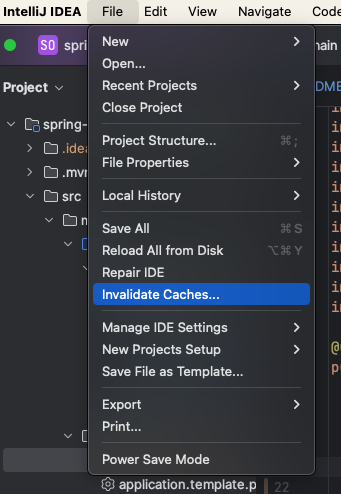

# spring-6-resttemplate-oauth2

Evolucionamos el proyecto `spring-6-resttemplate-security-basic` para poder acceder al Authentication Server, obtener un Token JWT, y luego usarlo en una petición del Resource Server.

Este proyecto utilizaba HTTP Basic Authentication, y lo vamos a cambiar para usar OAuth2 y Token JWT.

## Notas

1. Vamos a necesitar añadir una dependencia nueva al POM y aplicar ciertas propiedades

```
<dependency>
    <groupId>org.springframework.boot</groupId>
    <artifactId>spring-boot-starter-oauth2-client</artifactId>
</dependency>
```

```
# Configuración estándar de Spring Security para el cliente OAuth2
# En provider podemos indicar el nombre que queramos

spring.security.oauth2.resourceserver.jwt.issuer-uri=http://localhost:9000
spring.security.oauth2.client.registration.springauth.client-id=<client_id>
spring.security.oauth2.client.registration.springauth.client-secret=<client_secret>
spring.security.oauth2.client.registration.springauth.scope[0]=message.read
spring.security.oauth2.client.registration.springauth.scope[1]=message.write
spring.security.oauth2.client.registration.springauth.authorization-grant-type=client_credentials
spring.security.oauth2.client.registration.springauth.provider=<nombre_1>
# Vemos provider.<nombre_1> porque tiene que ser el mismo nombre que se indicó arriba en provider
spring.security.oauth2.client.provider.<nombre_1>.authorization-uri=http://localhost:9000/auth2/authorize
spring.security.oauth2.client.provider.<nombre_1>.token-uri=http://localhost:9000/oauth2/token
```

2. Necesitamos implementar un Authorize Client Manager, que es un nuevo componente de Spring que obtenemos de la dependencia añadida.

Maneja por nosotros las llamadas al Authorization Server, para obtener el token JWT.

3. Vamos a configurar una instancia de un cliente HTTP Request Interceptor.

La idea es que RestTemplate tenga un interceptor que valide si obtuvo autorización. Si no lo obtuvo lo va a añadir gracias también al Authentication Manager. 

4. Implementamos el interceptor en nuestro RestTemplateBuilder.

5. Puede que necesitemos limpiar la caché del proyecto. Para ello, en IntelliJ



6. Ejemplo para hacer un mocking de OAuth2 y token JWT

Ver `BeerClientMockTest.java`.

```
    // @MockBean crea un mock de Mockito y lo añade al contexto de Spring.
    @MockBean
    OAuth2AuthorizedClientManager manager;

    // Proveemos configuración en memoria.
    @TestConfiguration
    public static class TestConfig {

        @Bean
        ClientRegistrationRepository clientRegistrationRepository() {
            return new InMemoryClientRegistrationRepository(ClientRegistration
                    .withRegistrationId("springauth")
                    .authorizationGrantType(AuthorizationGrantType.CLIENT_CREDENTIALS)
                    .clientId("test")
                    .tokenUri("test")
                    .build());
        }

        @Bean
        OAuth2AuthorizedClientService auth2AuthorizedClientService(ClientRegistrationRepository clientRegistrationRepository) {
            return new InMemoryOAuth2AuthorizedClientService(clientRegistrationRepository);
        }

        @Bean
        OAuthClientInterceptor oAuthClientInterceptor(OAuth2AuthorizedClientManager manager, ClientRegistrationRepository clientRegistrationRepository) {
            return new OAuthClientInterceptor(manager, clientRegistrationRepository);
        }
    }

    // Lo inyecta gracias a que se genera en la clase de arriba como un @Bean.
    @Autowired
    ClientRegistrationRepository clientRegistrationRepository;

    @BeforeEach
    void setUp() throws JsonProcessingException {
        // Esta es la parte necesaria para configurar el mock de OAuth2 y el token JWT.
        ClientRegistration clientRegistration = clientRegistrationRepository
                .findByRegistrationId("springauth");

        OAuth2AccessToken token = new OAuth2AccessToken(OAuth2AccessToken.TokenType.BEARER,
                "test", Instant.MIN, Instant.MAX);

        when(manager.authorize(any())).thenReturn(new OAuth2AuthorizedClient(clientRegistration, "test", token));
    }
```

## Testing

- Clonar el repositorio
- Renombrar `application.template.properties` a `application.properties` e indicar sus valores
- Ejecutar los tests de la clase `BeerClientImplTest.java`
  - Tienen que estar en ejecución los siguientes proyectos: `spring-6-auth-server` y `spring-6-resource-server`
- Ejecutar los tests de la clase `BeerClientMockTest.java`
  - Para estos tests no es necesario que se ejecute ningún otro proyecto