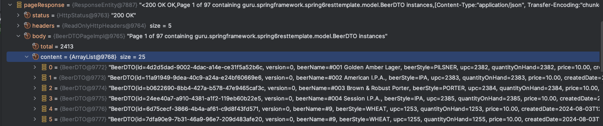

# spring-6-resttemplate

Proyecto nuevo con un ejemplo de uso de RestTemplate para hacer de cliente y realizar llamadas a endpoints.

Indicar que ahora se usa más WebClient como Rest Client reactivo. Lo veremos más adelante en el curso.

## Notas

1. Vemos pruebas de uso de Jackson para hacer parseo de JSON usando:

  ResponseEntity<String>

  ResponseEntity<Map>

  ResponseEntity<JsonNode>

  ResponseEntity<mi_pojo_java>

2. Vemos como mapear de un JSON a una clase POJO usando anotaciones

Ver `BeerDTOPageImpl.java`.

3. Cuando se está desarrollando contra una API, lo normal es consumirla desde más de un entorno.

Típicamente tendremos un entorno de test para ejecutarlo contra el test del backend y un entorno de producción, y lo normal es que las bases de URL sean distintas.

Lo que se hace para tratar esta problemática es configurar la instancia de RestTemplateBuilder dentro de Spring Boot (anotación `@Configuration`) para establecer la base de URL basada en una propiedad externalizada.

Cuando hablamos de base de URL nos referimos a `http://localhost:8080`.

Lo normal es mantener las configuraciones en un paquete `config` para mantenerlo todo organizado.

4. Externalizar por completo el hardcode de la base de URL, usando una property.

Se usa la anotación `@Value` y la property se crea en `application.properties`.

## Testing

- Clonar el repositorio
- Ejecutar el proyecto `spring-6-db-relationships` que será nuestro programa de backend
  - Se ejecuta en el puerto 8080
  - Nos concentramos en el método listBeers()
- Ejecutar los tests de este proyecto, que será el cliente y llamará a los endpoints del proyecto backend
  - Mirar el test `BeerClientImplTest`
  - No ejecutar el proyecto, solo el test, ya que fallará indicando que el puerto 8080 ya se está usando