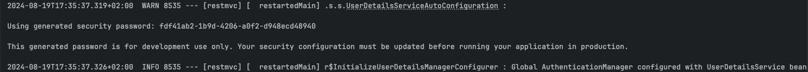
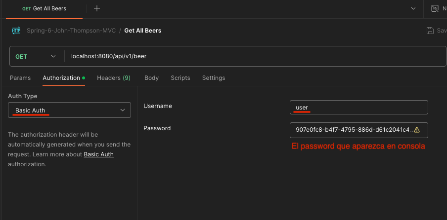

# spring-6-security-basic

Es el mismo proyecto `spring-6-db-relationships` (Spring MVC), donde vamos a securizar nuestras APIs.

HTTP Basic Authentication es una forma muy fácil y rápida de securizar y vamos a utilizar `Spring Security` para habilitarlo.

El problema es que las credenciales de seguridad, usuario y password, se pasan sin encriptar por Internet. La codificación en Base64 que puede usarse es muy fácil de decodificar.

Así que solo recomiendo usar este tipo de autenticación si tenemos habilitado HTTPS (encriptación por protocolo), aunque jamás lo utilizaría en un proyecto empresarial.

Lo que vamos a hacer en esta y las siguientes secciones, es configurar Spring Authentication Server y OAuth2, que utilizarán JWT.

## Notas

1. Una vez añadida la dependencia en el POM, Spring Boot autoconfigura HTTP Basic Security y securiza todos los endpoints.

Por defecto, el username es `user`.

Y, en esta imagen de la ejecución del proyecto, puede verse que se ha autogenerado un password (cambia con cada ejecución) para desarrollo usando Base64.

2. Configurar Postman para que tenga en cuenta HTTP Basic Security

## Testing

- Clonar el repositorio
- Renombrar `application-localmysql.template.properties` a `application-localmysql.properties` e indicar sus valores
- Ejecutar el proyecto con el siguiente profile activo `-Dspring.profiles.active=localmysql`
  - Importante si queremos usar MySql en vez de H2